# Table of Contents
1. [Overview of UDMS Architecture](#overview-of-udms-architecture)
1. [Redis](#redis)
    1. [User session](#user-session)
    1. [Caching](#caching)
    1. [Datasource repository](#datasource-repository)
    1. [System bus with Pub/Sub message queue](#system-bus-with-pubsub-message-queue)
1. [Other Infrastructure Components](#other-infrastructure-components)
    1. [MongoDB](#mongodb)
        1. [What we use MongoDB for?](#what-we-use-mongodb-for)
        1. [Why MongoDB?](#why-mongodb)
    1. [Elasticsearch](#elasticsearch)
        1. [What we use Elasticsearch for?](#what-we-use-elasticsearch-for)
        1. [Why Elasticsearch?](#why-elasticsearch)
        1. [Elasticsearch vs MongoDB](#elasticsearch-vs-mongodb)            
    1. [Neo4J](#neo4j)
        1. [What is Neo4J?](#what-is-neo4j)
        1. [Why are we interested in Neo4J?](#why-are-we-interested-in-neo4j)
    1. [MySQL and AzureSQL](#mysql-and-azuresql)
        1. [Why to include MySQL?](#why-to-include-mysql)
        1. [How to use AzureSQL?](#how-to-use-azuresql)
    1. [Dedicated queuing service](#dedicated-queuing-service)
        1. [What we need queue for?](#what-we-need-queue-for)
        1. [Which queue?](#which-queue)
1. [DAO](#dao)
    1. [Spring Data](#spring-data)
    1. [Entities and repositories](#entities-and-repositories)
    1. [SQL portability](#sql-portability)        
    1. [Lazy and eager loading](#lazy-and-eager-loading)
    1. [Entity serialization and hashing](#entity-serialization-and-hashing)
    1. [Consistent collection with pagination](#consistent-collection-with-pagination)
    1. [Stream alternative](#stream-alternative)
    1. [Converting existing DB schema to JPA entities](#converting-existing-db-schema-to-jpa-entities)
1. [GraphQL](#graphql)
    1. [Common functionality](#common-functionality)
    1. [DAO and GraphQL types](#dao-and-graphql-types)
    1. [GraphQL schema distribution in projects](#graphql-schema-distribution-in-projects)
    1. [GraphQL subscription and Java Stream](#graphql-subscription-and-java-stream)
    1. [Contract-first vs Code-first](#contract-first-vs-code-first)
1. [AOP](#aop)
    1. [Auditing](#auditing)
    1. [Dynamic datasource routing](#dynamic-datasource-routing)
    1. [Data Replication](#data-replication)
    1. [Logging](#logging)
    1. [GIS](#gis)
1. [Reactive Data-binding and Synchronization](#reactive-data-binding-and-synchronization)
    1. [A single "truth"](#a-single-truth)
    1. [Many incarnations](#many-incarnations)
    1. [Synchronization](#synchronization)
    1. [Data-replicator](#data-replicator)    
1. [Microservice Composition](#microservice-composition)
    1. [API service/gateway pair](#api-servicegateway-pair)
    1. [User-facing service vs batch processor](#user-facing-service-vs-batch-processor)
    1. [Headless service](#headless-service)
    1. [Segregation of product lines](#segregation-of-product-lines)    
1. [Microservice Deployment Platform](#microservice-deployment-platform)
    1. [Importance of a deployment platform](#importance-of-a-deployment-platform)
    1. [Kubernetes](#kubernetes)
1. [UDMS with Kubernetes](#udms-with-kubernetes)
    1. [Prospects](#prospects)
    1. [Deployment targets](#deployment-targets)
        1. [localhost](#localhost)
        1. [Minikube](#minikube)
        1. [Google Cloud](#google-cloud)
        1. [Azure](#azure)
    1. [Jenkins integration](#jenkins-integration)
1. [Security](#security)
    1. [User Session](#user-session)
    1. [CSRF and other cross-site concerns](#csrf-and-other-cross-site-concerns)
    1. [AA-SSO](#aa-sso)
    1. [AzureAD](#azuread)
    1. [OAuth2](#oauth2)
1. [UI](#ui)
    1. [Angular](#angular)
    1. [Apollo](#apollo)
    1. [NgRx](#ngrx)
    1. [PrimeNG](#primeng)
1. [Unit Testing](#unit-testing)
    1. [Data markup and initialization](#data-markup-and-initialization)
    2. [Spock](#spock)
1. [Conclusion](#conclusion)    
    

## Overview of UDMS Architecture
UDMS (Unified Data Management System) is a cloud-based, generic application frameork for civic applications and 
services. The early emphasize of the project is about the exploration and POC development for Web Services based on 
Spring/Spring-Boot framework, and Angular(TM) on the frontend.

One of the early overriding objectives of UDMS is to build a system that is modular, based on mico-service principle. 
This remains the main objective, and a linchpin of UDMS!

We want to develop a modern system that is small, clean and coherent, a core foundation that can stand the test of time, 
and grow organically along with our experience and business needs. The minimalism is our motto! While the richness of 
web technology and frameworks gives us almost limitless options, it can also leads us astray or incapacitate us from 
making progress and decisions.

We also want to develop a **unified** model (the U in UDMS) in application and data management, where we can leverage 
and integrate various technologies and application/data platforms, in anticipating and embracing the technological 
diversity (and its strength) than in reaction to unmanaged fragmentation. UDMS starts mainly as a Java (or JVM-based) 
project, but aimed to go well beyond being Java-cetric.

Our objective and experience align well with Spring Framework! While being a time-tested and mature technology, whose modular 
and lightweight design philosophy resonates with ours, Spring remains progressive and innovative. The latest Spring Boot 
development can be considered a game-changer. Spring has long promised to simplify Java development, Spring Boot 
simplifies Spring! Spring is also a rich eco-system that encompasses the full-spectrum of enterprise computation, in 
an integrated and coherent way. We feel that it is a sensible and safe bet to start every our technical decision based 
on a default Spring integration, do it "Spring way"!

The project inevitably evolves into an exploration that covers full gamut of Spring, including JPA/Spring Data for data 
access, Spring AOP for modular code development, Caching, Spring Security, Spring Session, and Spring Cloud for service 
discovery and scalability.

GraphQL was discovered along the way, as a notable exception - a technology that is not Java centric and is not yet 
natively integrated with Spring. But we feel that GraphQL is a promising nascent technology, which evolves Web Service 
and Restful paradigm. We feel that GraphQL addresses many inefficiencies and pain points associated with Restful 
service and UI development, particularly relevant for OpenCivic products that are often required to deal with large sets 
of diverse data.

We also drew inspiration from modern UI frameworks like Angular/React in their event handling and reactive data-binding, 
to build up our own One-Data model that scales, so-to-speak, Angular model to the whole cloud. Data synchronization has 
been a sore spot in many existing systems, always a performance and maintainability challenge. First and foremost, 
One-Data attempts to instill a coherent mental model of our data: data that starts and ends with SQL database - its sole 
mutable datastore, the only "truth" - but can be propagated into and synchronized with many its incarnations, such as 
indices in Elasticsearch for global search, documents in MongoDB for auditing, datasets in a reporting engine for data 
analysis, and UI (yes, UI too as a data sink) for data visualization and user interface. We implement this One-Data 
model with a **system bus** that is based on Redis Pub/Sub queue and a data-replicator microservice.

Multitenancy is the hallmark of modern cloud computing and cloud hosting. However, comes with it are many technical 
challenges: data security and privacy, service and performance segregation (noisy neighbour problem), versioning, 
service availability - just to name a few. UDMS is designed, from the ground-up, to address multitenancy and its 
challenges. We assume from the beginning that we will need to deal with a large number (100+) of diverse databases 
dynamically. To put that number in front of us from the get-go, helps us to develop a robust strategy, instead of 
patchworks, to address its management challenge. Multiple sub-systems/components - centralized datasource management, 
routing datasource and AOP, container/microservice deployment with data and resource isolation - collaborate to make 
this a reality!  

Performance and Reliability is probably the most sought-after "feature" and the ultimate expectation from users, 
therefore an objective that drives many UDMS design decisions. A directly related concern is scalability and load 
balancing. To effectively scale, besides a mechanism for service discovery and distribution, each microservice also 
needs to be stateless or with a cloud-based state management. Along with Redis, we have adopted Spring Session, as well 
as Spring Cache for centralized caching. Early implementation uses Spring Cloud/Eureka for service discovery and load 
balancing.

Yet, the biggest revelation comes from our desire to scale our system automatically and dynamically. While Eureka offers
support for service discovery and load balancing, even QoS with service regulation and breaker, it lacks the capability 
to scale services automatically and dynamically. Such dynamism has to come from the environment itself on which all 
services run. This is where Containers and their orchestration tools, such as Kubernetes, comes in. By deploying our 
webservices on Kubernetes, we replaced Eureka with K8S Service for service discovery and load balancing, and we
achieved auto-scaling of our services with K8S Horizontal Pod Autoscaler. Our experience working with Kubernetes also 
made us realizing that K8S is not mere a deployment tool, but a **platform** on which we author our services, the same
way we write our desktop or a mobile apps to run on a specific platform/OS. Kubernetes qualifies as such an OS; it is 
the "data-center OS"! For this reason, a deployment model/platform can not, and should not, be a separate concern 
or an after-thought of a system design, but an integral part of application architecture from the get-go! This 
probably accentuates the rationale behind some recent DevOps movement, and a mindset for application developers to 
adopt.

A full-fledged deployment platform like Kubernetes goes beyond automatic scaling and optimal resource utilization. It 
can also recover a failed service due to hardware or software malfunctions, therefore QoS with self-healing. It offers 
batch job processing and retries. It has a higher-level (mostly declarative) programming/operational model that improves 
engineers' productivity and effectiveness. We also envision the portability of a platform will benefit both on-promise 
and in-cloud users with a level of hardware and infrastructure independence!                  

- Standalone UDMS with Spring Cloud/Eureka

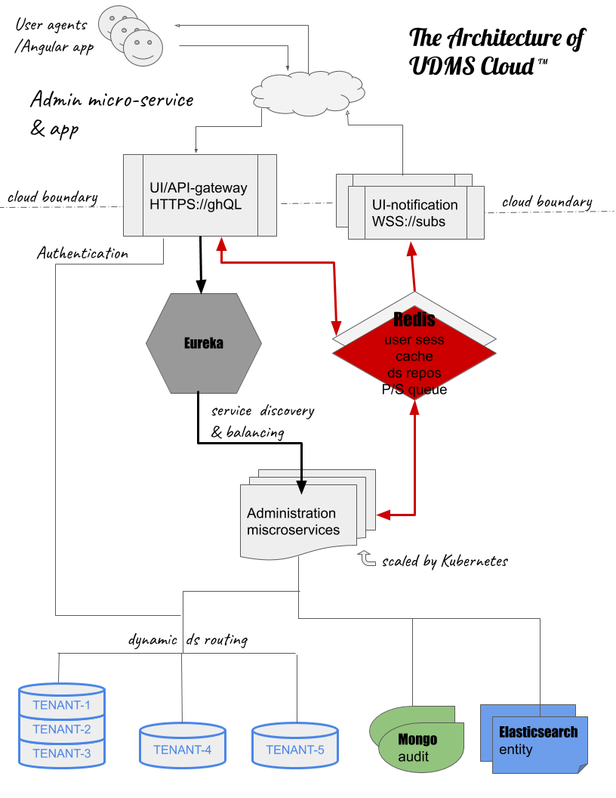

- UDMS Deployed/Integrated with Kubernetes

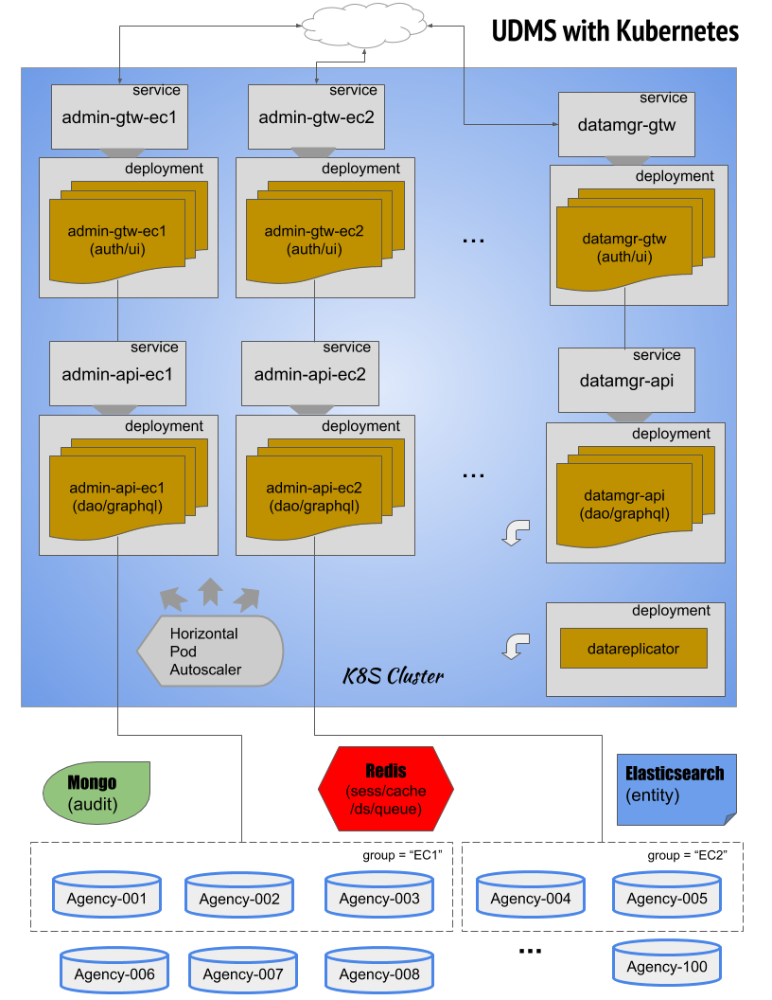
  
Next, we will delve into individual components or aspects of the system, their roles in "the grand scheme of things", 
some nitty-gritty technical details, and collaborations among them to form a fully functional UDMS Cloud. 
    
## Redis
Redis is at the heart of UDMS cloud, providing:
- Cloud-based user session
- Centralized caching
- Dynamic data source repository
- System bus with Pub/Sub message queue

Why Redis? here are some our reasons:
- Redis works very well, and VERY fast! and over time, we grew trust in it! It is also resource efficient.
- Redis has first-class integration with Spring - working with Redis in Spring is super easy. 
- Redis is a popular in-memory datastore, also widely supported among all hosting platforms.
- Redis is versatile, a rare breed among in-memory datastores with its data structure support, as well as message queues.
- The Versatility of Redis is particularly appealing to us, aligning well with our minimalism motto! If we can pick one   
system that does more, we'd be happy to pick less, particularly to get UDMS off ground.
- Redis also has in it one of the most liberal open-source licence, one less concern for any production deployment.

Here is a survey from 2016 that details how features in Redis being used in the real world:

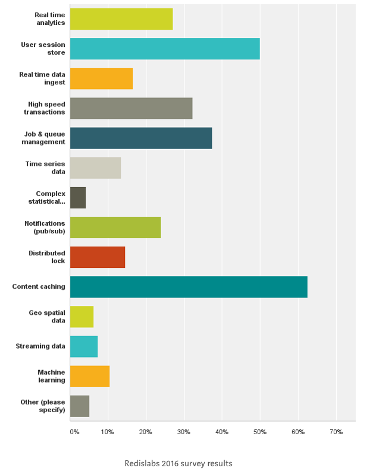

### User session
- One of the most popular usage of Redis is for storing user session.
- Cloud-based user session replaces traditional container-based session, such as HttpSession provided by Tomcat server, 
to offer a shared user session context.
- While most cloud infrastructure offers some kind of load balancing with sticky session, cloud-based user session has 
the advantage of being able to truly scale services independently. 
- It is trivial to activate Redis for user session in Spring Boot:
  - Add Spring Session dependency `implementation 'org.springframework.session:spring-session-core'`
  - Add Spring Session Redis dependency: `implementation 'org.springframework.session:spring-session-data-redis'`

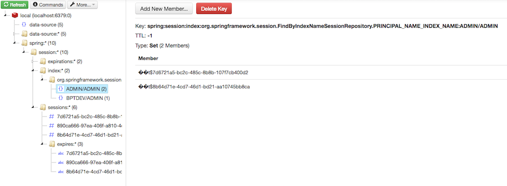

### Caching
- Centralized cache improves cloud performance and resource utilization by sharing cache among multiple service 
instances.
- Centralized cache reduces overall network traffic and load on databases.
- To enable cache in Spring, simply add an annotation to a targeted method: `@Cacheable(...)`    

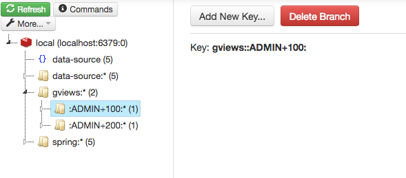

### Datasource repository
- Datasource store enables effective management of any number of databases.
- Dynamic nature of datasource store allows for run-time configurations with no or minimal service interruption.
- Datasource profile enables robust multi-agency support.
- Routing datasource is implemented at: 
[OpenCivicRoutingDataSource.java](https://github.com/open-civic/udms/blob/master/dao/src/main/java/io/opencivic/udms/dao/datasource/OpenCivicRoutingDataSource.java)   

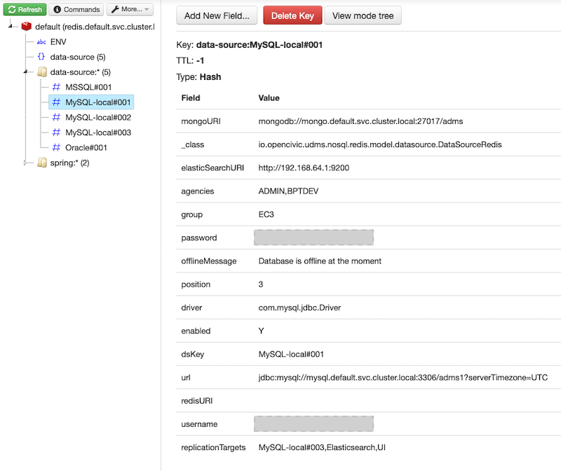

### System bus with Pub/Sub message queue
- Pub/Sub queue acts as the _cloud bus_ for data notification and synchronization.
- Pub/Sub queue is used and consumed by various microservice components.
  - Data Replicator service
  - UI and event notification
- Redis Queue topic and publisher setup example: [RedisQueueConfig.java](https://github.com/open-civic/udms/blob/master/cloud/src/main/java/io/opencivic/udms/cloud/redis/queue/RedisQueueConfig.java)

## Other Infrastructure Components
### MongoDB
#### What we use MongoDB for?
Currently, we have set up MongoDB for auditing.
 
#### Why MongoDB?
- MongoDB is a well established and well supported document database.
- MongoDB is well suited for a _generic_ auditing service, where the entity type being audited is not pre-determined.
- MongoDB has proved in the real world for its performance and scalability, allowing us to build an extensive 
auditing service.
- MongoDB is well integrated with Spring, to access it:
  - Add gradle dependency: `api 'org.springframework.boot:spring-boot-starter-data-mongodb-reactive'`
  - Add application configuration: `spring.data.mongodb.host, port, database ...` 

### Elasticsearch
#### What we use Elasticsearch for?
We use Elasticsearch for full-text global search. Elasticsearch adopts a document model, similar to MongoDB. 
Elasticsearch is also a comprehensive platform in its own right - along with a data visualization tool (Kibana) and a 
data collection pipeline (Logstash), collectively known as Elastic Stack, it may offer some advanced features that 
UDMS applications may find useful. A full exploration and deployment of Elastic Stack remains a future endeavor in UDMS.  

#### Why Elasticsearch?
- Elasticsearch optimizes on full-text search capability.

#### Elasticsearch vs MongoDB
- Similarities apart, there seems to be a different business objectives and design philosophy between MongoDB and 
Elasticsearch.
- MongoDB focuses on its scalability - being (hu)mongo(us), with excellent query capability, including a full-text 
search.
- Elasticsearch made its name doing search, while still emphasizing its scalability.
- Elasticsearch is a lot more resource hungry, also more complicated in setup and containerization, which does 
give us a pause.
- In comparison, MongoDB looks like a much simpler proposal. We found no trouble to understand what MongoDB does, while 
left with an impression that Elasticsearch trying to impose too much on us.
- MongoDB probably aligns better with our minimalistic design philosophy at the moment. But we should learn more about 
Elasticsearch and explore Elastic Stack at its full scope.
- We see no objection to use both at the same time, each for its own strength, while avoiding their pitfalls.  

### Neo4J
#### What is Neo4J?
Neo4J is a graph database, that organizes and stores its data in a graph data structure, as opposed to normalized sets 
in a relational database. A graph database stores relationship explicitly while allowing you to collect full data sets 
indirectly through graph traversal. In contrast, a relational database stores data sets (preferably normalized) 
explicitly while its relationship implicitly (through foreign keys and join operation). 

As a result, while relational databases provide a straightforward and efficient (when normalized) data storage strategy, 
they can also be woefully inefficient at times in retrieving relationships, particularly complicated relationships 
that go many levels deep. Graph databases, on the other hand, excel in relationships at the expense of storage space and 
other operations.   
 
#### Why are we interested in Neo4J?
OpenCivic can have data sets of deep and complicated relationships, area of potential performance concerns. If properly 
deployed as a go-between layer for data retrieval and SQL query, a graph database like Neo4J can potentially be a 
game-changer! Think of Neo4J as your Elasticsearch for SQL query.

With many performance gains we strive to achieve with modern JPA, lazy loading and GraphQL web service, our need for a 
graph database may have lessened. But it remains an interesting area for exploration!     

### MySQL and AzureSQL
#### Why to include MySQL?
MySQL can be used as a convenient, free local database for developers. Its ubiquitous deployments can also help to make 
a truer microservice configuration more feasible - each microservice gets its own database.

MySQL also accentuates, even though not a production DB, the portability of JPA. 

#### How to use AzureSQL?
AzureSQL can be set up in Azure. It is basically compatible with MSSQL, and can be connected with a MSSQL JDBC driver. 
There are firewall rules that need to be configured on Azure in order to access AzureSQL from outside, but unnecessary 
to connect to it from within.

### Dedicated queuing service
#### What we need queue for?
The biggest reason is for building an asynchronous (therefore responsive, aka reactive), de-coupled (therefore dynamic), 
and resilient system that is fault tolerant (with regard to network and system anomaly). A queue fulfills this mission 
by keeps things for us, and promises to do so reliably, until we get down to our business eventually.

Given our minimalist inclination, we may not want to make another queue since we already have Redis, and we hope that it 
can just do it all. Nevertheless, we found queuing support in Redis is also a minimalist at best. A full message queue 
system, particularly an easy to work with blocking queue is still needed to complete UDMS.

#### Which queue?
This may literally be a million-dollar question! So it is a costly question, and more notably, a time-consuming one: 
many choices, many ideas, and a decision may just take forever to make.

Our best bet might just be to take small, impermanent, minimalistic decisions based on our needs at hand, adapt and 
refactor as we go. Another sensible bet is to start with a message queue that Spring has picked for us - the one with 
the best integration and support with Spring. This is the area still left for exploration in UDMS.     

## DAO
### Spring Data
Spring Data project provides a unified API to work with all datastores, relational or NoSQL. It also provides a 
programming model that makes use of a DSL to define your query methods based on a naming scheme.

Spring Data greatly simplifies DAO development.

### Entities and repositories
- Entities are all defined in `io.opencivic.udms.dao.entity` package (there going to be a lot of them!)
- Spring repositories are all defined in `io.opencivic.udms.dao.repository` package.
- Each repository corresponds to one _root-level_ entity that may have one or several child entities; example: 
Gview & GviewElement.
- UDMS always operates on _root-level_ entity, via its corresponding repository.
 
### SQL portability
Among many other features, one of the great benefits with JPA is SQL portability. This makes SQL conversion tools, as 
well as vendor specific dao code,  obsolete!
 
### Lazy and eager loading
- Lazy loading is key to our dao performance!
- JPA default fetch type: 
  - OneToMany: LAZY
  - ManyToOne: EAGER
  - ManyToMany: LAZY
  - OneToOne: EAGER
- fetch type can be overridden by [EntityGraph](https://docs.spring.io/spring-data/jpa/docs/current/reference/html/) 
feature introduced from JPA 2.1 and corresponding Spring annotation.
- Lazy loading is integrated with GraphQL resolvers, example: 
[GviewElementsQuery.java](https://github.com/open-civic/udms/blob/master/apps/adaemon/administration/api/src/main/java/io/opencivic/udms/administration/api/formdesigner/graphql/resolvers/GviewElementsQuery.java)
- There is, however, an eager version of JPA methods, through a customized interface: 
[Eager.java](https://github.com/open-civic/udms/blob/master/dao/src/main/java/io/opencivic/udms/dao/repository/common/Eager.java) 
& [EagerImpl.java](https://github.com/open-civic/udms/blob/master/dao/src/main/java/io/opencivic/udms/dao/repository/common/EagerImpl.java)      

### Entity serialization and hashing
Instead of serialization to text or XML format, Java object serialization and de-serialization is much more speedy and 
space efficient. We have also complemented JPA entities with a customized hashing function that can be used for entity
comparison when deciding whether to override an existing database entry in our new data-manager tool.
- Implementation of a customized hash function: 
[EntityUtil.java](https://github.com/open-civic/udms/blob/master/dao/src/main/java/io/opencivic/udms/dao/entity/common/EntityUtil.java)

### Consistent collection with pagination
We propose a consistent dao interface with collections:
- All dao methods that return a collection will be paginated, even if it has only one page.
- This will force a client caller to always think of a collection in pages, no more careless, performance-killing,  
getting-it-all query without deliberation!
- This unifies UI (Angular) code by a consistent response data structure.

### Stream alternative
- For a very large dataset out of and into a database, we may consider a different alternative with stream interface.
- This prevents us from overrunning our memory space - a problem common in many web applications.

### Converting existing DB schema to JPA entities
Instead of constructing and annotating JPA entity manually, use automated tool!
- For IntelliJ IDEA     
  - Open `Tool Windows` -> `Pesistence`
  - Choose the persistence unit, right click
  - Choose `Generate Persistence Mapping` -> `By Database Schema`
  - ... [Implementation details on JPA conversion](https://github.com/open-civic/udms/blob/master/dao/README.md#Tool-support-for-converting-DB-schema-to-JPA-entities)  

## GraphQL
### Common functionality
project(':graphql') contains GraphQL scalar types, and other features and type definitions that are shared among all 
modules that use GraphQL.

### DAO and GraphQL types
- Each _root-level_ JPA entity has one corresponding GraphQL type resource, under 
$UDMS/dao/src/main/resources/graphql.
- Each such resource file defines the root-level entity and all its children.
- A GraphQL type resource is to be co-created with a root-level JPA entity.

### GraphQL schema distribution in projects
- By default, GraphQL Java engine searches classpath, and all its sub folders, for GraphQL resources.
- We distribute GraphQL resources among multiple gradle projects, for easy sharing and better organization.
- Dependencies among those GraphQL resources is reflected in dependencies among their hosting projects. 
 
### GraphQL subscription and Java Stream
- GraphQL subscription negotiates a Websocket connection with a web browser.
- It is implemented with RxJava library and Stream API.
- Add gradle dependency: `implementation 'io.reactivex.rxjava2:rxjava:2.1.5'`
- GraphQL subscription and its UI notification is now part of api-gateway component of each microservice.
   
### Contract-first vs Code-first
- We have mostly implemented GraphQL in Contract-first fashion, mostly because we are creating UDMS from scratch.
- Code-first approach can also be considered to retrofit existing service into GraphQL.
- We may explore other libraries and implementations that may further simplify and optimize GraphQL development.

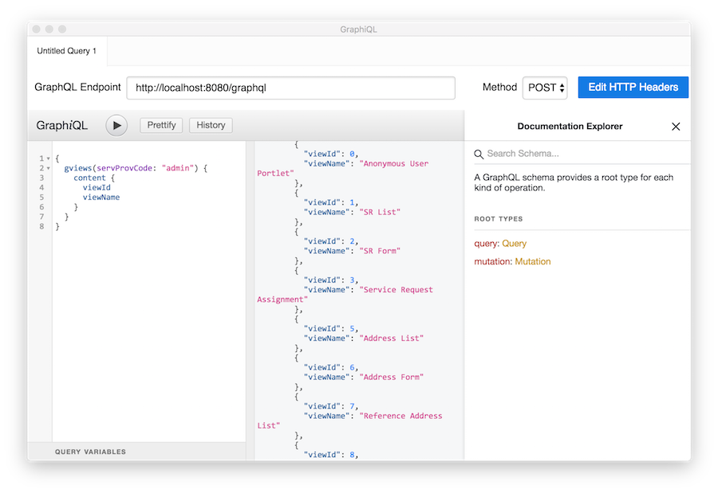 

## AOP
Aspect Oriented Programming (AOP) is a programming paradigm that promotes modularity by organizing code around 
"cross-cutting concerns", such as logging, event notification etc. AOP is one of the two pillars of Spring (the other
being Dependency Injection). We found several compelling use cases of AOP in UDMS:

### Auditing
Ubiquitous auditing that captures all data mutations in UDMS, is implemented cleanly and elegantly through AOP, within 
a single Aspect: 
[AuditGraphQLMutationAspect.java](https://github.com/open-civic/udms/blob/master/audit/src/main/java/io/opencivic/udms/audit/AuditGraphQLMutationAspect.java).

### Dynamic datasource routing
It would not be possible to implement routing datasource reliably, therefore robust multi-agency support, without AOP: 
[RoutingDataSourceAspect.java](https://github.com/open-civic/udms/blob/master/dao/src/main/java/io/opencivic/udms/dao/RoutingDataSourceAspect.java).

### Data Replication
Data replication also benefits greatly from AOP: 
[DataReplicationAspect.java](https://github.com/open-civic/udms/blob/master/apps/adaemon/administration/api/src/main/java/io/opencivic/udms/administration/api/DataReplicationAspect.java).

### Logging
We have not yet introduced AOP to logging. But it is one of the most natural candidates.

### GIS
We have long talked about making civic data objects (such as inpections, city assets, street work order etc.) 
"spatial-aware". AOP seems to be a perfect fit to bring that awareness (Aspect!) to all OpenCivic data objects in an elegant way! An exciting area 
of exploration!

## Reactive Data-binding and Synchronization

### A single "truth"
- A single **mutable** datastore in SQL

### Many incarnations
- Document in MongoDB for auditing
- Document in Elasticsearch for global searching
- Relationship in Neo4J for deep query
- Dataset in reporting engine for reports

### Synchronization
- Synchronization through a system bus namely Redis!  

### Data-replicator
- Datareplicator as a headless microservice

## Microservice Composition
### API service/gateway pair
- Example: administration-api & administration-gateway
### User-facing service vs batch processor
- Example: datamanager primarily as a batch processor
### Headless service
- Example: datareplicator
### Segregation of product lines
- Example: all adaemon services in adaemon namespace.

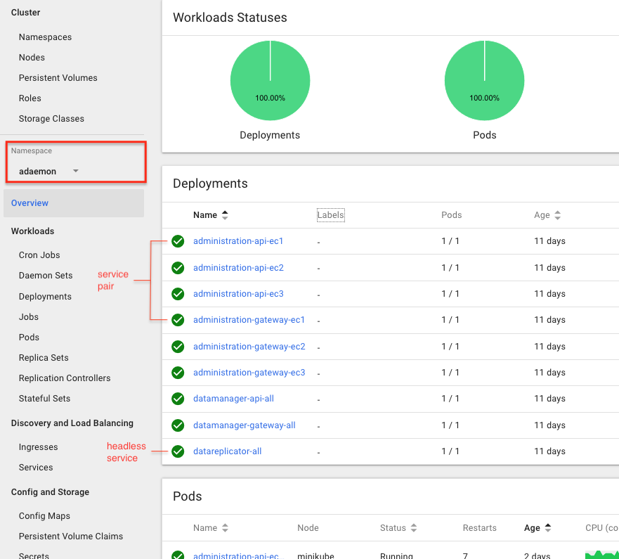

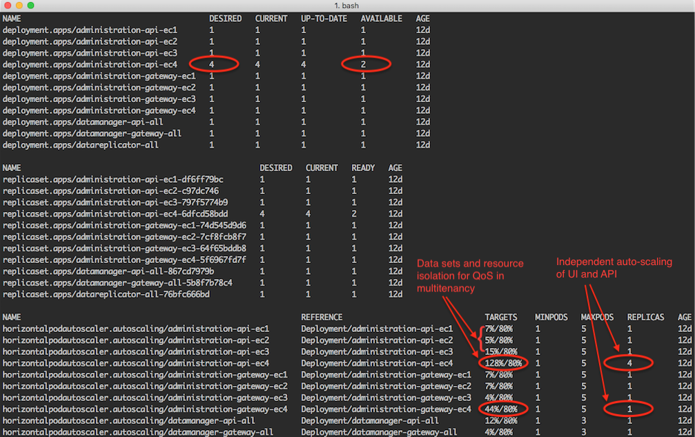

## Microservice Deployment Platform
### Importance of a deployment platform
- A deployment platform is an integral part of the architecture.
- A deployment platform is the "**OS**" for which a microservice application is developed.
- A deployment platform plays an important role in service discovery and communication.
- A high-level deployment platform offers portability among cloud hosting system and hardware diversity, which
can be a significant factor in supporting on-premise customers.
- A high-level deployment platform promotes effective programming/operation model to create a more robust
system, particularly complex one, often in a declarative way.

### Kubernetes
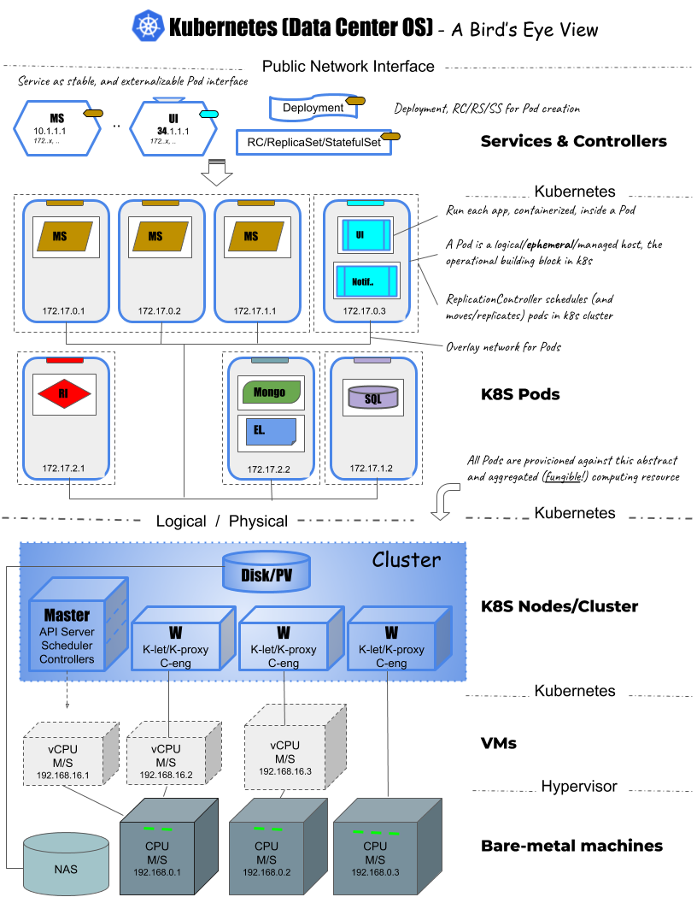

## UDMS with Kubernetes
### Prospects
- Micro-service architecture for OpenCivic products and services.
- Flexible and robust multi-agency support to connect to a large number of databases (100+) simultaneously.
- Independent scaling of UI, data service, and supporting service components
- Optimized infrastructure utilization with on-demand automatic scaling up (and down).
- QoS with service self-healing and recovery in response to hardware and software malfunction.
- Live roll-out (and roll-back) with software updates with no or minimal downtime.
- Kubernetes jobs as an alternative for reliable batch processor.
- Unified deployment (and CI/CD) model across OpenCivic Hosting, On-premise, Dev/QA/Support environments.
- Expandable with kubernetes elastic cluster, namespaced segregation and seamless incorporation of diverse product 
categories over time. 
- Progressive integration with existing legacy platform as a strategy for long-term product/technology migration.

### Deployment targets

#### localhost
- UDMS can be developed and deployed in localhost, with containerized Redis, Mongo, Elasticsearch & MySQL.
- UDMS microservices do not have to be containerized or deployed to K8S, for rapid local code development.
- [Setup in localhost](https://github.com/open-civic/udms#setup-process-for-localhost)

#### Minikube
- Minikube is "The data center in your laptop"!
- Minikube deployment provides a full production-like environment, including auto-scaling and load balancing, to test 
and verify UDMS Cloud in its intended setting.
- [Deployment to Minikube](https://github.com/open-civic/udms#deployment-to-minikube)
   
#### Google Cloud
- gke-disk is specified as a storage class: 
[storageclass.yaml](https://github.com/open-civic/udms/blob/master/z-kube/gke/storageclass.yaml)
- [Deployment to Google Cloud](https://github.com/open-civic/udms#deployment-to-google-cloud)

#### Azure
- AzureSQL is set up as an Azure specific datasource.
- Azure-disk is specified as a storage class: 
[storageclass.yaml](https://github.com/open-civic/udms/blob/master/z-kube/aks/storageclass.yaml)
- [Deployment to Azure](https://github.com/open-civic/udms#deployment-to-azure)

### Jenkins integration
- TBD

## Security
### User Session
- See: [User session](#user-session)

### CSRF and other cross-site concerns
- TBD

### AA-SSO
- AA-SSO provides **A**uthentication/**A**uthorization service based on user data currently stored in a legacy RDMS.
- It is implemented in gradle proejct(':security:AA-SSO'), to be included as a dependency for any microservice that 
requires AA authentication services, such as all API gateways.
- Currently, only authentication service is provided; Authorization can be added later.
- AA-SSO is still a traditional web authentication/authorization method than a more centralized id provider (idP) 
solution, but it makes use of existing user data in RDMS.
- Identity Provider and Solutions is a rather complex landscape, It is, at the moment, a low priority for 
UDMS, but an important future development.
 
### AzureAD
- TBD

### OAuth2
- TBD

## UI
### Angular
- Angular build is integrated into main gradle build - therefore no separate UI build is needed.
- You, however, can still build and run Angular project independently, form within your ui directory, such as from 
`udms/apps/adaemon/administration/gateway/ui`
- Angular bundle is included, and served as static content, into API gateway jar file.
- There is a 'RapidDev' mode for Angular, so that it can be built and served without building and running gateway 
itself: `ng serve --configuration RapidDev`

### Apollo
- Apollo is used to communicate with GraphQL service.
- Apollo also offers built-in caching and state management that is based on Redux, which may lessen our need for a 
dedicated state management framework like NgRx.

### NgRx
- It remains to be determined whether we need NgRx in UDMS, given features already provided in Apollo. Further 
understanding and exploration of NgRx is needed.

### PrimeNG
- TBD

## Unit Testing
### Data markup and initialization
- Some exploration of testing and data markup framework is needed.
- Containerization may give us more tools for environment setup and teardown - more exploration is needed.
- Our data-manager offers more help - more exploration is needed.
  
### Spock
- Spock is a very powerful and versatile test framework!
- Example: [GviewSpecification.groovy](https://github.com/open-civic/udms/blob/master/dao/src/test/groovy/io/opencivic/udms/dao/entity/GviewSpecification.groovy) 
and [RbizdomainSpecification.groovy](https://github.com/open-civic/udms/blob/master/dao/src/test/groovy/io/opencivic/udms/dao/entity/RbizdomainSpecification.groovy).

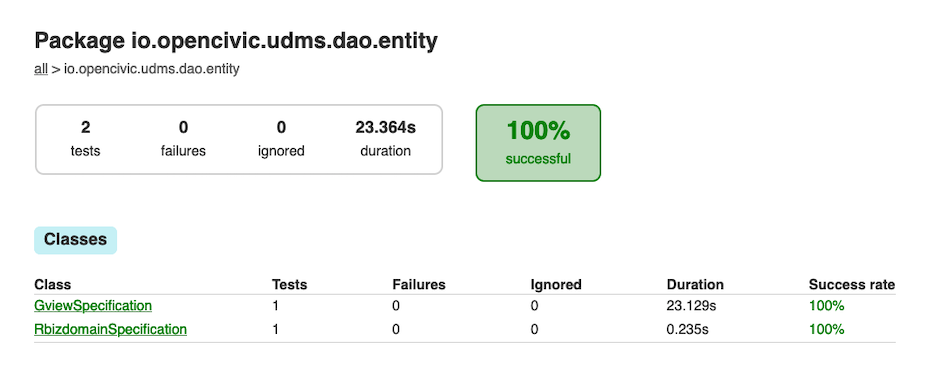

## Conclusion
Two key nascent technologies we incorporated in UDMS - GraphQL and Kubernetes - could be the missing pieces in solving 
the enterprise computing puzzle. Along with tried-and-true good development practices and frameworks, such as AOP, Spring Data, 
and other lightweight Spring components, we hope that we've had a wholistic and comprehensive system design and 
strategy that can actually make our microservice architecture practical, effective and manageable, development process 
productive and indeed agile. This _wholistic_ view is the value of UDMS!

We want to make a case for Kubernetes, not just for its transformative features and services, but also for its 
value as a platform and paradigm. Given the ease it brings (along with containers) for components of different origins 
to interact and to collaborate, why can't a Java microservice co-exist and collaborate with a .Net or a Node.js 
component? It feels totally natural in UDMS! And, it can unlock more resource, developer talents and innovation of the 
web today and tomorrow. Kubernetes can serve as a true foundation to enable such potentials! 

Such an unified and higher-level view of a computing platform also yields many other tangible benefits, for instance, a 
local deployment (in Minikube) that resembles a genuine production environment (data-center in your laptop!). It is 
obvious the value to have such an environment in development and testing, which was beyond our reach until now.

It is often said that "the elephant in the room" in software development is the software you already have! This 
speaks for the nature of software development and real challenge in maintaining and evolving a software system. With 
UDMS, we can seamlessly integrate UDMS components with existing legacy systems, and migrate them _progressively_ over 
time. UDMS can easily co-exist and co-deploy with legacy systems, yet independent in its code-base and development. 

UDMS is the beginning of a new story ... for an open future, of a better governance and civic service! 